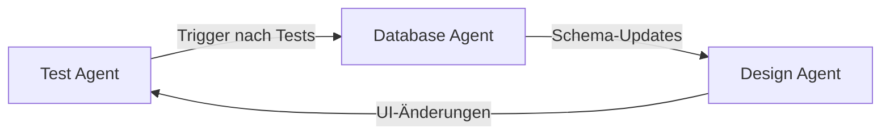

# 🤖 CARVITRA Agent Briefings

## 📋 Übersicht

Dieses Verzeichnis enthält alle Agent-Briefings für automatisierte Entwicklungs- und Qualitätssicherungsprozesse im CARVITRA-Projekt.

## 🗂️ Struktur

```
agent-briefings/
├── README.md                      # Diese Datei
├── database-integrity-agent.md    # Datenbank-Konsistenz-Prüfung
├── design-compliance-agent.md     # UI/UX Design-Compliance
└── test-automation-agent.md       # Automatisierte E2E-Tests

.claude/agents/                    # Claude-spezifische Agent-Konfigurationen
├── database-integrity-checker.md
├── design-compliance-checker.md
└── test-automation-checker.md
```

## 🎯 Agent-Beschreibungen

### 1. **Database Integrity Agent** (`database-integrity-agent.md`)
- **Zweck**: Überprüft Datenbank-Konsistenz zwischen Supabase und Code
- **Trigger**: Migrationen, Schema-Änderungen, RLS-Updates
- **Features**: 
  - Schema-Synchronisation
  - RLS-Policy-Validierung
  - Performance-Monitoring
  - Selbstlern-Mechanismus
- **Tools**: Supabase MCP, SQL-Queries

### 2. **Design Compliance Agent** (`design-compliance-agent.md`)
- **Zweck**: Stellt sicher, dass UI-Implementierungen den Design-Standards folgen
- **Trigger**: UI-Änderungen, neue Komponenten, Theme-Updates
- **Features**:
  - Untitled UI Komponenten-Validierung
  - Theme-Konsistenz-Prüfung
  - Icon-System-Compliance
  - Performance-Patterns
- **Tools**: Read, Grep, Component-Analysis

### 3. **Test Automation Agent** (`test-automation-agent.md`)
- **Zweck**: Führt automatisierte End-to-End-Tests durch
- **Trigger**: Feature-Implementierung, Pre-Deployment, Bug-Fixes
- **Features**:
  - Playwright-basierte Tests
  - Visual Testing
  - User Journey Validation
  - Performance-Tests
- **Tools**: Playwright MCP, Screenshot-Capture

## 🔧 Verwendung

### Manueller Agent-Aufruf
```typescript
// In Claude Code
await Task.invoke({
  subagent_type: "database-integrity-checker",
  description: "Check database consistency",
  prompt: "Verify all RLS policies are properly configured"
});
```

### Automatische Trigger
Die Agenten werden automatisch bei bestimmten Events ausgelöst:
- Code-Änderungen in relevanten Dateien
- Git-Commits mit bestimmten Keywords
- CI/CD-Pipeline-Events

## 📝 Namenskonvention

**Format**: `{domain}-{action}-agent.md`

- `domain`: Bereich (database, design, test)
- `action`: Hauptaktion (integrity, compliance, automation)
- `agent`: Suffix für Klarheit

## 🔄 Updates & Wartung

### Selbstlern-Mechanismus
Alle Agenten haben einen eingebauten Selbstlern-Mechanismus:
1. Neue Patterns werden automatisch erkannt
2. Dokumentation wird selbstständig erweitert
3. Best Practices werden kontinuierlich verbessert

### Manuelle Updates
Bei strukturellen Änderungen:
1. Update der Haupt-Briefing-Datei
2. Update der Claude-Config in `.claude/agents/`
3. Test der Agent-Funktionalität
4. Dokumentation in diesem README

## 🚀 Best Practices

1. **Konsistenz**: Alle Agenten folgen dem gleichen Strukturformat
2. **Dokumentation**: Jeder Agent hat klare Trigger-Events und Workflows
3. **Testbarkeit**: Agenten können isoliert getestet werden
4. **Erweiterbarkeit**: Neue Agenten folgen der etablierten Konvention

## 🔗 Verwandte Dokumentation

- **CLAUDE.md**: Hauptdokumentation für Entwicklungsrichtlinien
- **Agent-Konfigurationen**: `.claude/agents/` für Claude-spezifische Agenten
- **Playwright Config**: `playwright.config.ts` für Test-Setup

## 📚 Agent-Kollaboration

Agenten können miteinander interagieren:


## 🆕 Neue Agenten hinzufügen

1. Erstelle `{domain}-{action}-agent.md` in diesem Verzeichnis
2. Füge Claude-Config in `.claude/agents/{name}.md` hinzu
3. Update dieses README
4. Teste Agent-Funktionalität mit `/agents` Befehl
5. Dokumentiere in CLAUDE.md

---

*Letzte Aktualisierung: Januar 2025*
*Alle Agent-Briefings sind selbstlernend und werden kontinuierlich verbessert.*